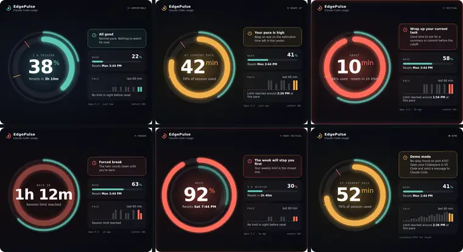
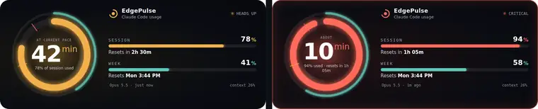

  

<b>Live Claude Code usage on the CORSAIR XENEON EDGE.</b>

<a href="README.md">Français</a> · <b>English</b>

EdgePulse is an iCUE widget that shows your Claude Code usage limits (5 hour session and weekly) in a glowing double halo that adapts to the situation: comfortable, heads up, critical, forced break, week critical and reset.

> **Works with Claude Code in GitHub Codespaces, opened in VS Code on your PC.** The relay installs in your Codespaces, and VS Code passes the data to the widget on your XENEON EDGE. Claude Code installed directly on Windows isn't supported yet.

  

  

## How it works

1. Claude Code sends your limits to its status line (`statusLine`).
2. The EdgePulse status line stores them and starts a small local relay on port 4747.
3. VS Code forwards that port to your PC (Codespaces, containers, SSH).
4. The widget reads `http://localhost:4747/usage` and displays the data.

The widget shows French or English based on your Windows language.

No credentials are read or sent: EdgePulse only uses the data Claude Code officially provides to its status line. Works with a Pro or Max subscription.

## Installation

**👉 Follow the [complete installation guide](docs/INSTALLATION.en.md).** In short:

1. **The relay**: copy the contents of the `relay/` folder into your GitHub `dotfiles` repository and enable dotfiles in your Codespaces settings.
2. **The check**: send a message to Claude Code, then open `http://localhost:4747/usage` on your PC.
3. **The widget**: download the `.icuewidget` file from [Releases](../../releases) and import it into iCUE, on an S or M tile.

## Requirements

- CORSAIR XENEON EDGE and iCUE 5.45 or newer
- Claude **Pro or Max** subscription
- Claude Code in **GitHub Codespaces**, opened with **desktop VS Code**

## Repository contents

| Folder | Contents |
|---|---|
| `widget/` | The iCUE widget |
| `relay/` | The relay to copy into your `dotfiles` repository (install and uninstall) |
| `docs/` | The installation guide |

## Disclaimer

EdgePulse is an independent project, not affiliated with Anthropic, CORSAIR or Elgato. "Claude Code" is only used to describe what the widget measures.

## License

MIT
