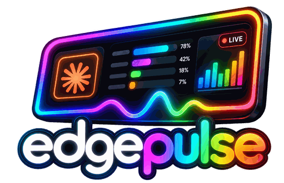
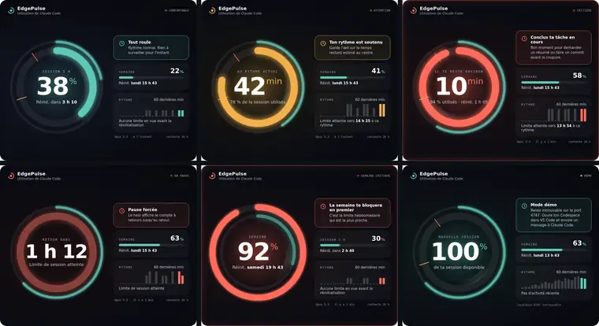
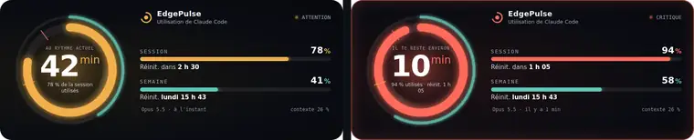

  

<b>Utilisation de Claude Code en temps réel sur le CORSAIR XENEON EDGE.</b>

  
  
  
  
  

<b>Français</b> · <a href="README.en.md">English</a>

EdgePulse est un widget iCUE qui affiche tes limites d'utilisation de Claude Code (session de 5 heures et semaine) dans un double halo lumineux qui s'adapte à la situation : calme, attention, critique, pause forcée, semaine critique et réinitialisation.

> **Fonctionne avec Claude Code dans GitHub Codespaces, ouvert dans VS Code sur ton PC.** Le relais s'installe dans tes Codespaces, et VS Code transmet les données au widget sur ton XENEON EDGE. Claude Code installé directement sur Windows n'est pas encore pris en charge.

  

  

## Comment ça marche

1. Claude Code transmet tes limites à sa ligne d'état (`statusLine`).
2. La ligne d'état EdgePulse les garde et démarre un petit relais local sur le port 4747.
3. VS Code redirige ce port vers ton PC (Codespaces, conteneurs, SSH).
4. Le widget lit `http://localhost:4747/usage` et affiche les données.

Le widget s'affiche en français ou en anglais selon la langue de Windows.

Aucun identifiant n'est lu ni transmis : EdgePulse utilise seulement les données que Claude Code fournit officiellement à sa ligne d'état. Fonctionne avec un abonnement Pro ou Max.

## Installation

**👉 Suis le [guide d'installation complet](docs/INSTALLATION.md).** En résumé :

1. **Le relais** : copie le contenu du dossier `relay/` dans ton dépôt GitHub `dotfiles` et active les dotfiles dans tes paramètres Codespaces.
2. **La vérification** : envoie un message à Claude Code, puis ouvre `http://localhost:4747/usage` sur ton PC.
3. **Le widget** : télécharge le fichier `.icuewidget` dans les [Releases](../../releases) et importe-le dans iCUE, sur une tuile S ou M.

## Prérequis

- CORSAIR XENEON EDGE et iCUE 5.45 ou plus récent
- Abonnement Claude **Pro ou Max**
- Claude Code dans **GitHub Codespaces**, ouvert avec **VS Code de bureau**

## Contenu du dépôt

| Dossier | Contenu |
|---|---|
| `widget/` | Le widget iCUE |
| `relay/` | Le relais à copier dans ton dépôt `dotfiles` (installation et désinstallation) |
| `docs/` | Le guide d'installation |

## Avertissement

EdgePulse est un projet indépendant, non affilié à Anthropic, CORSAIR ou Elgato. « Claude Code » sert seulement à décrire ce que le widget mesure.

## Licence

MIT
